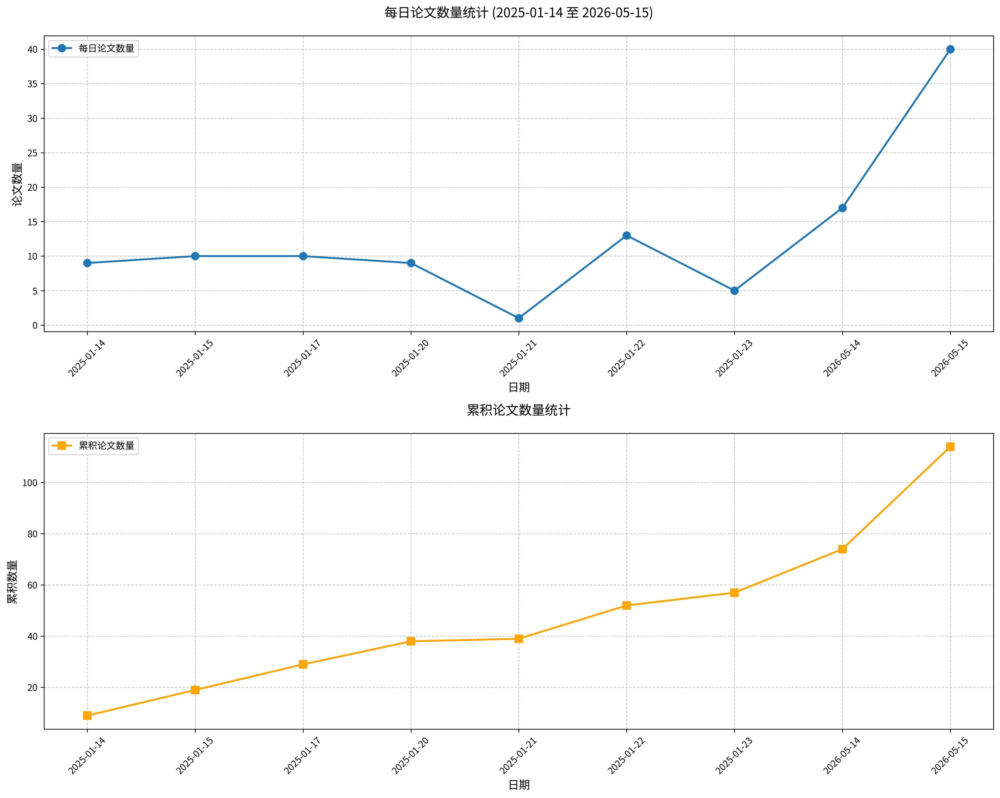

# 学术论文日报 (2026-05-15)

## 📊 今日论文统计
- 总论文数：39
- 热门领域：综合领域

## 📝 论文详情

### 1. 急性压力损害社交焦虑个体的注意控制与情绪加工

**原文标题：** Acute stress impairs attentional control and emotional processing in social anxiety.

**摘要：**
加工情绪面孔对社交焦虑个体构成特殊挑战。急性社交压力可能进一步改变注意力分配与情绪加工，然而这些变化的时间性神经动态仍不明确。本研究利用脑电图（EEG），通过注意力威胁偏向任务和被动观看面孔任务，在压力诱导后考察了注意偏向与面孔加工。结果显示，急性压力使持续的视觉空间注意力偏向左侧视野，表明在竞争性情感刺激间重新分配注意力的灵活性降低。压力还广泛降低了事件相关电位（ERP）振幅，并减弱了额叶α事件相关去同步化（alpha ERD），提示注意力资源可用性与皮层控制减弱。值得注意的是，对威胁性面孔的早期快速反应保持不变。这些发现表明，急性压力通过消耗持续注意和调节参与所需的资源，重组了注意力加工，可能加剧社交焦虑中社会信息加工的脆弱性。

**关键词：** 急性压力；社交焦虑；注意力控制；情绪加工；事件相关电位

**论文链接：** [PubMed](https://pubmed.ncbi.nlm.nih.gov/42111210/)

---

### 2. NSUN5缺失通过增加基底外侧杏仁核小胶质细胞活化和损害LTD诱导引发小鼠焦虑样行为

**原文标题：** NSUN5 Deficiency Drives Anxiety-Like Behaviors in Mice via Increased Microglial Activation and Impaired LTD Induction in the Basolateral Amygdala.

**摘要：**
威廉姆斯-伯伦综合征（WBS）是一种神经发育障碍，以焦虑、过度社交和神经认知异常为特征，由染色体7q11.23杂合微缺失引起。胞嘧啶-5 RNA甲基转移酶NSUN5是缺失基因之一，与WBS患者的认知缺陷相关。然而，NSUN5与焦虑障碍的关系及其潜在机制仍不清楚。本研究发现，在成年雄性和雌性小鼠中，NSUN5缺失会引发焦虑样行为，但无过度社交表现。NSUN5在基底外侧杏仁核（BLA）的少突胶质前体细胞（OPCs）中特异性表达，而BLA是与焦虑相关的主要脑区之一。此外，NSUN5缺失导致小鼠OPCs增殖减少，伴随小胶质细胞活化。机制上，我们发现NSUN5缺陷小鼠中OPCs来源的成纤维细胞生长因子2（FGF2）分泌特异性下降，导致小胶质细胞活化，并加剧TNFα和IL-1β细胞因子水平。NSUN5缺陷小鼠外囊-BLA突触的场兴奋性突触后电位（fEPSPs）斜率增加。此外，NSUN5缺陷小鼠观察到配对脉冲抑制增强和长时程抑制（LTD）诱导受损，这些效应可通过BLA内注射重组小鼠FGF2（rmFGF2）或药理抑制小胶质细胞活化（米诺环素）得到挽救。进一步，rmFGF2或米诺环素处理也缓解了NSUN5缺陷小鼠的焦虑样行为。综上所述，本研究揭示了NSUN5对焦虑障碍的先前未知影响，以及NSUN5在调节OPCs-小胶质细胞相互作用和BLA突触可塑性中的作用。

**关键词：** 焦虑样行为；NSUN5；小胶质细胞活化；长时程抑制；基底外侧杏仁核

**论文链接：** [PubMed](https://pubmed.ncbi.nlm.nih.gov/42051124/)

---

### 3. 运动系统中疼痛位置的预测性编码：基于躯体运动α波和皮质脊髓兴奋性的证据

**原文标题：** Predictive encoding of pain location in the motor system indexed by somatomotor alpha and corticospinal excitability.

**摘要：**
疼痛网络不仅要响应疼痛，还必须预测其发生，以主动引导防御性反应。然而，疼痛相关预测如何在神经系统中被学习和更新仍不清楚。通过一项巴甫洛夫威胁条件化任务，参与者学习两种不同视觉线索分别预测左臂或右臂的疼痛电击，而第三种线索始终不预测疼痛。习得后，线索-疼痛关联被反转以评估预测更新。在疼痛预期（即线索呈现）期间，使用脑电图、皮肤电反应和双线圈经颅磁刺激记录神经和自主神经反应，以测量预期疼痛位置对侧和同侧的皮质脊髓兴奋性。我们发现，皮肤电反应双侧增强，且与预测的疼痛位置无关，反映了自主神经系统的一般性威胁准备状态。相比之下，躯体运动α波功率的抑制和皮质脊髓兴奋性的降低呈现偏侧化且在功能上耦合，表明运动系统对预测疼痛位置进行了精确调节。在反转阶段，前中央θ波功率增加，支持了先前学习到的疼痛预测的更新。连接性分析进一步证实了这一点，揭示了躯体运动与前中央振荡活动的动态交互作用。这些发现共同推进了对伤害感受神经认知机制的理解，表明疼痛预期由支持一般威胁检测和情境敏感性防御反应的可分离但相互作用的网络所支撑。

**关键词：** 疼痛预测；躯体运动α波；皮质脊髓兴奋性；条件化；自主神经反应

**论文链接：** [PubMed](https://pubmed.ncbi.nlm.nih.gov/41956432/)

---

### 4. 压力下的动态脑网络重构：一项多阶段功能磁共振成像研究

**原文标题：** Dynamic brain network reconfiguration under stress: A multiphase fMRI study.

**摘要：**
急性压力在三个阶段（压力前、压力中、压力后）诱导神经资源的动态重新分配。尽管对孤立阶段已有广泛研究，但在理解这种资源重构如何塑造整个时间连续体上的大脑动态特征方面，仍存在关键空白。为弥补这一空白，我们使用隐马尔可夫模型（HMM）在两组独立队列（ScanSTRESS，n=77，35名女性；蒙特利尔压力成像任务，n=48，24名女性）中连续研究了所有阶段的全局脑网络动态。结果显示，两个队列中均出现大规模脑网络的快速且可逆的时空重构，同时皮质醇水平升高。具体而言，从压力前到压力阶段，观察到脑网络显著的时空重构，其特征是执行控制网络的整体激活抑制、感觉处理增强，以及突显网络、感觉网络和执行网络之间的功能耦合增加。这些变化在压力后阶段逆转，压力前与压力后阶段之间无显著差异。关键的是，我们发现了稳健的个体差异：女性在压力期间表现出更高的状态转换率，且较差的压力后恢复指数（与基线偏差更大）与更高的抑郁和焦虑评分相关。综合这些发现，我们提出三阶段网络重构模型，认为适应稳态通过阶段特异性的大脑状态库和定向转换实现。这一动态框架增进了我们对压力适应的理解，并为这些过程在压力相关精神病理学中可能失调提供了可检验的假说。

**关键词：** 压力；脑网络重构；情绪；隐马尔可夫模型；个体差异

**论文链接：** [PubMed](https://pubmed.ncbi.nlm.nih.gov/41933848/)

---

### 5. 猫鼬短音叫声的语境依赖性变异反映情绪唤起

**原文标题：** Context-dependent variation in meerkat short note calls reflects emotional arousal.

**摘要：**
许多动物在不同情境下发出相同类型的叫声，但声学变异可编码额外信息，例如发出者的情绪状态。通过这种方式，动物在可能有限的发声库中增强了沟通能力。猫鼬（*Suricata suricatta*）在晒太阳（即沐浴阳光）和哨兵（即合作警戒）这两种不同行为情境下会发出多种短音叫声。这两种情境可能在潜在的情绪唤起程度上有所不同。我们首先研究了晒太阳和哨兵情境下心率是否存在差异，以指示唤起状态的潜在变异。其次，我们检验了晒太阳和哨兵期间发出的叫声在生产速率、叫声类型和声学结构上是否存在差异。我们为野生猫鼬植入了心率记录器，并记录了它们的行为和发声。结果发现，哨兵行为伴随更高心率和更高叫声速率，表明情感唤起增强。与晒太阳期间发出的叫声相比，哨兵期间叫声的声学结构与唤起增强的预测一致，表现为抖颤增加、持续时间缩短和起始更为突然。总体而言，我们的结果表明哨兵行为期间的情绪唤起高于晒太阳行为，这反映在心脏活动、叫声速率和声学变异上。我们的研究结果强调，即使在简短、看似简单的发声序列中，声学变异也能增强所传递的信息量。

**关键词：** 情绪唤起；声学变异；叫声情境依赖性；猫鼬；生理测量

**论文链接：** [PubMed](https://pubmed.ncbi.nlm.nih.gov/41702488/)

---

### 6. 父母教养方式与子女情感支持模式对中国中老年人抑郁症状轨迹的预测作用

**原文标题：** How pattern of parental care and child emotional support predicts trajectories of depressive symptoms among Chinese middle-age and older adults.

**摘要：**
背景：晚年抑郁显示出异质性发展轨迹。以往针对中国老年人群的研究已识别出不同的抑郁轨迹，但生命历程中家庭情感支持的影响仍未得到充分探讨。我们将代际情感互动模式概念化为早期父母关爱与成年子女后期情感支持的组合配置。本研究识别了晚年抑郁轨迹，并检验这些模式是否预测中国老年人的抑郁轨迹。方法：利用中国健康与养老追踪调查数据（2011-2020年；n=9888），通过潜在类别增长模型识别抑郁轨迹，并采用潜在剖面分析根据母亲/父亲关爱及成年子女的情感支持将参与者分为亚组。多项逻辑回归和卡方检验评估了剖面与轨迹之间的关联。结果：出现四种抑郁轨迹：“无抑郁”（56.3%）、“恶化”（22.4%）、“缓解”（12.3%）和“慢性抑郁”（9.1%）。发现三种不同的代际情感互动模式：“情感继承”（40.7%）、“情感补偿”（17.4%）和“情感错配”（41.9%）。“情感继承”组在“无抑郁”轨迹中占比过高，而“情感补偿”组被分类为“恶化”和“慢性抑郁”轨迹的风险更高。结论：代际情感互动模式与晚年抑郁症状轨迹独立且联合相关。童年期父母关爱高且持续获得子女情感支持的个体表现出最强的保护效应。相反，低父母关爱——即使后期获得情感补偿——也与更差的心理健康结局相关。

**关键词：** 抑郁轨迹；代际情感互动；父母教养；情感支持；中国老年人

**论文链接：** [PubMed](https://pubmed.ncbi.nlm.nih.gov/41651236/)

---

### 7. 当共情稀缺时：零和信念如何加剧亲密关系中的抑郁

**原文标题：** When empathy feels scarce: How zero-sum beliefs fuel depression in close relationships.

**摘要：**
本研究探讨了零和信念（将情绪资源视为有限的认知方式）如何塑造个体在日常浪漫互动中的情绪体验。通过经验取样法和双人设计，我们收集了198对异性恋浪漫伴侣（共396名个体）的数据，并在14天内获得了5280个有效的每日观察记录。研究考察了个体零和信念如何通过两条路径影响自身及伴侣的日常抑郁情绪：共情参与的减少和对感知到的共情失衡的敏感性增强。结果表明，持有更强零和信念的个体往往向伴侣提供更少的共情，并且更容易经历共情权衡，这两者均预测了抑郁水平的升高。值得注意的是，男性零和信念意外地与女性伴侣较低的抑郁情绪相关，这提示了一种潜在的适应性脱离机制。这些发现将零和信念研究的理论范围扩展至亲密关系，并强调了人际信念系统在塑造情绪健康中的作用。理解个体如何从认知上构建共情，可能为制定针对性干预措施以缓解情绪压力并促进关系福祉提供关键见解。

**关键词：** 零和信念；共情；抑郁；亲密关系；经验取样

**论文链接：** [PubMed](https://pubmed.ncbi.nlm.nih.gov/41643775/)

---

### 8. PTSD症状调节解释偏差修正对敌意解释偏差和特质愤怒的影响

**原文标题：** PTSD symptoms moderate the effects of interpretation bias modification on hostile interpretation bias and trait anger.

**摘要：**
愤怒水平较高的个体倾向于将模糊情境解释为具有敌意，从而维持其愤怒状态。重要的是，敌意解释偏差和愤怒均与物质使用障碍和自杀等不良后果相关。研究发现，敌意解释偏差修正（IBM-H）能有效减少敌意归因偏差，但其对愤怒的减轻效果结果不一。创伤后应激障碍（PTSD）症状可能是这些结果的情境化因素，因其与敌意解释偏差和愤怒均相关。本研究以76名愤怒水平较高的创伤暴露吸烟者为样本，考察了PTSD症状对IBM-H效果的潜在调节作用。IBM-H与健康放松视频对照条件进行比较。在基线PTSD症状较高（+1标准差）的参与者中，与对照组相比，IBM-H组在治疗后特质愤怒显著降低，但PTSD症状较低的个体中，条件对愤怒无显著影响。此外，在PTSD症状较高的个体中，敌意解释偏差的变化完全中介了IBM-H对愤怒的效果。这些发现初步支持IBM-H对愤怒的干预可能对PTSD症状较高者最有效。然而，鉴于样本为希望戒烟的创伤暴露吸烟者，研究结果的普适性有限。未来研究应考察IBM-H对愤怒的干预在PTSD患者（包括吸烟者和非吸烟者）中的效果，以及其对物质使用障碍、抑郁和PTSD症状等次要结局的影响。

**关键词：** 创伤后应激障碍；敌意解释偏差；特质愤怒；解释偏差修正；情绪调节

**论文链接：** [PubMed](https://pubmed.ncbi.nlm.nih.gov/41638503/)

---

### 9. 性别依赖的GBR 12909对情感行为的破坏效应：与双相障碍的相关性

**原文标题：** Sex-dependent disruption of affective behaviors by GBR 12909: relevance to bipolar disorders.

**摘要：**
双相障碍（BD）的特征是躁狂相和抑郁相的慢性循环。除了情绪波动外，急性发作期常伴随情感改变。这些变化的生物学基础尚不明确，主要原因是模拟BD的循环属性在临床前研究中仍是重大挑战。一种药理学模型基于GBR 12909给药，这是一种旨在模拟躁狂某些维度的多巴胺转运蛋白抑制剂。近期发现表明，该模型产生混合表型，将高活动性与负性愉悦偏差及焦虑相结合。这些研究仅在雄性动物中进行，且与BD相关的其他行为维度仍有待探索，特别是对同种情绪状态的识别和对危险的反应性。本研究旨在通过引入两种新的行为测试——扫视/逼近圆盘任务和负性情绪识别任务（分别评估威胁反应和情绪辨别）——进一步在两种性别的小鼠中表征GBR模型。首先，我们在GBR模型中复制了先前结果：雄性小鼠表现出更高的焦虑、高活动性和快感缺失。这些表型在雌性中较不显著且未达到统计学意义。GBR在两种性别的扫视/逼近圆盘任务中均诱导了对威胁的超敏反应。仅雄性中，GBR消除了对情绪目标的偏好，提示情绪识别受损。本工作引入了与BD研究相关的新表型维度，并强调需研究两种性别，因其行为反应并非完全等同。

**关键词：** 双相障碍；GBR 12909；情感行为；性别差异；情绪识别

**论文链接：** [PubMed](https://pubmed.ncbi.nlm.nih.gov/41638469/)

---

### 10. 产后抑郁症状女性的注意偏向：一项比较眼动研究

**原文标题：** Attentional biases in women with postpartum depressive symptoms: A comparative eye-tracking study.

**摘要：**
背景：产后抑郁（PPD）与情绪加工的改变有关，然而对婴儿情绪表达的注意偏向仍知之甚少，且研究结果不一致。本研究考察了有PPD症状的母亲与无症状母亲及非抑郁非母亲群体在注视情绪性婴儿和成人面孔时的视觉注意差异。方法：研究对象包括26名有PPD症状的母亲、30名无症状母亲和21名非抑郁非母亲。参与者完成了一项自由观看眼动任务，任务中呈现了婴儿和成人的情绪性（快乐、愤怒、悲伤）及中性面孔。采用线性混合模型分析初始定向和注意维持指标。结果：与两个对照组相比，有PPD症状的母亲对快乐婴儿面孔的定向更快，但这种早期偏向并未伴随更强的持续注意。PPD症状严重程度与对婴儿悲伤的较慢定向呈边缘显著相关。在后期阶段，有PPD症状的母亲对婴儿悲伤的回避减少，并对愤怒婴儿表情的持续注意增加。较高的PPD得分与对婴儿和成人面孔负性表情的持续注意增强相关。在成人刺激方面，有PPD症状的母亲对负性表情的持续注意增加，对正性表情的加工减少，而无PPD症状的母亲和非母亲则优先注意快乐面孔。结论：PPD与一种动态的、情境依赖的注意模式相关，而非单一偏向。虽然对成人面孔的注意加工符合抑郁症的认知模型，但对婴儿面孔的反应则呈现更复杂的模式，即早期定向偏向积极刺激，但随后被消极线索所捕获。

**关键词：** 产后抑郁；注意偏向；眼动追踪；面部表情；情绪加工

**论文链接：** [PubMed](https://pubmed.ncbi.nlm.nih.gov/41633451/)

---

### 11. 一项针对广泛性焦虑的人工智能心理健康干预的探索性随机对照试验

**原文标题：** An exploratory randomized controlled trial of an AI-enabled mental health intervention for generalized anxiety.

**摘要：**
广泛性焦虑障碍（GAD）普遍存在，常与抑郁症共病，导致显著的功能障碍和医疗负担。尽管认知行为疗法（CBT）和选择性5-羟色胺再摄取抑制剂（SSRIs）等治疗方法有效，但可及性仍然有限。这项探索性随机对照试验评估了一款人工智能驱动的心理健康应用（PATH）在减轻焦虑和抑郁症状方面的效果。共有316名英国参与者（年龄19-70岁）被随机分配到干预组（PATH）或对照组（NHS自助网站）。干预措施提供了基于证据的策略，包括基于CBT的聊天疗法和互动工具。在基线、第2周、第8周和第12周测量了焦虑（GAD-7）和抑郁（PHQ-9）评分。在316名随机参与者中，235人完成了干预后评估（干预组流失率为33.0%，对照组为18.5%）。第8周和第12周随访的保留率分别为77.4%和54.0%。在第2周，干预组的GAD-7和PHQ-9评分显著低于对照组，效应量为中等。在第8周，继续使用该应用的参与者在焦虑和抑郁方面均表现出显著改善，而停止使用的参与者仍表现出中等程度的焦虑改善。效果在第12周得以维持，效应量为中等到大。研究结果表明，PATH能显著减少焦虑和抑郁症状，尤其是在持续使用的情况下。这些结果支持该应用作为可扩展、可获取的数字干预措施，以弥补心理治疗差距的潜力。

**关键词：** 广泛性焦虑障碍；人工智能；数字心理健康干预；随机对照试验；认知行为疗法

**论文链接：** [PubMed](https://pubmed.ncbi.nlm.nih.gov/41633449/)

---

### 12. 有氧运动对CSDS诱导的青春期小鼠抑郁样行为及海马转录组学的影响

**原文标题：** Effects of aerobic exercise on depression-like behaviors and hippocampal transcriptomics in CSDS-induced adolescent mice.

**摘要：**
背景：青春期是易患抑郁症的关键时期，但大多数关于运动抗抑郁作用的证据来自成年模型。本研究旨在探讨有氧运动对青春期抑郁小鼠模型的影响，并识别其相关的分子变化。
方法：在青春期雄性C57BL/6J小鼠中建立慢性社交挫败应激（CSDS）模型以诱导抑郁样行为。36只小鼠随机分为三组：对照组（CG）、模型组（MG）和模型加运动组（ME）。MG和ME组小鼠接受两周（第7-20天）CSDS处理，而ME组小鼠额外在整个CSDS期间（第0-20天）接受三周的跑台有氧训练。在第21-26天进行行为测试，随后收集血清和海马组织进行分子、组织学和转录组学分析。
结果：CSDS在青春期雄性小鼠中诱导了显著的抑郁样行为，包括社交回避、快感缺失和行为绝望，有氧运动有效缓解了这些行为。有氧运动似乎减轻了CSDS诱导的神经损伤并维持海马组织完整性。此外，有氧运动增加了血清中血清素水平。转录组学分析鉴定出587个差异表达基因（DEGs）。在这些基因中，59个重叠DEGs受CSDS和运动共同调控，并富集于碳水化合物代谢和胆碱能信号通路。
结论：有氧运动缓解了青春期雄性小鼠的抑郁样行为，可能通过调节海马基因表达——尤其是在胆碱能和碳水化合物代谢通路中——这为运动如何影响外周单胺水平及海马结构完整性提供了潜在线索。这些推定的机制需要进一步研究。

**关键词：** 有氧运动；青春期抑郁；慢性社交挫败应激；海马转录组；胆碱能通路

**论文链接：** [PubMed](https://pubmed.ncbi.nlm.nih.gov/41628748/)

---

### 13. 抑郁与焦虑纵向轨迹的预测模型：系统综述

**原文标题：** Prediction models for longitudinal trajectories of depression and anxiety: a systematic review.

**摘要：**
背景：预测非典型健康轨迹可能有助于早期干预。我们系统回顾了关于预测纵向抑郁和/或焦虑轨迹的现有模型文献。方法：检索MEDLINE、Embase和APA PsycINFO（从建库至2025年1月31日）。纳入基于人群的儿童和成人（年龄3-65岁）研究。使用预测模型偏倚风险评估工具（PROBAST-AI）评估偏倚风险。结果：九项纳入研究中，七项针对基线已确诊抑郁或焦虑的成人人群；两项聚焦于儿童和青少年人群。仅一项研究涉及焦虑轨迹。识别出的轨迹通常包含三至四组：慢性/持续-高、稳定-低、上升/恶化、改善/缓解组。使用了多种监督式预测建模方法。模型中最终纳入的预测因子数量从3到152个不等。家族史和自身/个人精神病史是最常见的预测因子，但对模型性能并非总是重要。纳入更多预测因子的模型并不总是表现更优。所有研究总体偏倚风险均较高。无研究进行外部验证，也无研究评估模型的临床实用性。结论：本综述强调需要稳健、经过验证的模型，以预测持续性或恶化性焦虑和抑郁的未来风险，尤其是在可能进行早期干预的年轻人中。

**关键词：** 抑郁；焦虑；纵向轨迹；预测模型；系统综述

**论文链接：** [PubMed](https://pubmed.ncbi.nlm.nih.gov/41621444/)

---

### 14. 右侧眶额皮层rTMS靶向改善首发精神分裂症的焦虑而非抑郁症状

**原文标题：** Right orbitofrontal cortex rTMS targets anxiety, not depressive, symptoms in first-episode schizophrenia.

**摘要：**
背景：焦虑在首发精神分裂症（FES）中高度普遍且治疗不足，但关于重复经颅磁刺激（rTMS）对此共病的研究数据匮乏。眶额皮层（OFC）是关键的焦虑调节节点，支持其作为潜在治疗靶点。本研究旨在探索1-Hz右侧OFC-rTMS对FES情绪的特定症状效果。
方法：本研究是对一项随机对照试验的二次分析。参与者为未用药的FES患者，随机分配至主动rTMS组（n=51）或假刺激组（n=45）。所有参与者完成20次干预疗程（主动组接受20次OFC-rTMS，假刺激组接受假刺激），并进行4周随访，在首次rTMS治疗时同时开始口服奥氮平（10-20 mg/天）。采用24项汉密尔顿抑郁量表（HAMD）和14项汉密尔顿焦虑量表（HAMA）评估情绪症状，采用阳性与阴性症状量表（PANSS）评估精神病理症状。主要结局指标为从基线至第2周和第4周的HAMD和HAMA评分变化。
结果：与假刺激组相比，主动组的PANSS总分（t=-3.260, p=0.002；Cohen's d=0.672）及分量表改善更大。重复测量方差分析（控制协变量）显示，时间×组别交互作用对HAMA总分（F=4.698, p=0.010；偏η²=0.059）和精神性焦虑（F=5.735, p=0.004；偏η²=0.072）显著，但对躯体性焦虑不显著。对于HAMD，仅焦虑/躯体化（F=8.397, p=0.031；偏η²=0.099）和认知障碍（F=6.240, p=0.002；偏η²=0.076）存在交互作用，对总体抑郁症状无特异性效果。在假刺激组中，HAMD焦虑/躯体化与所有PANSS分量表相关（r=0.311-0.477, p<0.05），但这种相关性在主动组中消失（所有p>0.05）。
结论：右侧OFC-rTMS改善FES的焦虑症状（而非抑郁症状），支持其作为靶向非药物选择。

**关键词：** 右侧眶额皮层；重复经颅磁刺激；焦虑；首发精神分裂症；情绪症状

**论文链接：** [PubMed](https://pubmed.ncbi.nlm.nih.gov/41620181/)

---

### 15. 生命早期不可预测性与以色列-哈马斯战争期间心理健康的关系：情绪失调与心理困扰的纵向研究

**原文标题：** Associations between early-life unpredictability and mental health during the Israel-Hamas war.

**摘要：**
战争暴露会增加情绪和心理困扰的风险，尤其对于存在先前脆弱性的人群。根据心理病理学的生命史发展模型，生命早期经历的不可预测性预示着成年后对情绪失调和心理症状的更高脆弱性。此外，敏化假说认为这种效应在当前压力环境下应尤为显著。本研究追踪了2023年10月7日爆发的以色列-哈马斯战争前后，成年以色列犹太人群的情绪失调与心理困扰轨迹，以及生命早期不可预测性的调节作用。参与者（N=720）在战前接受两次评估，并在战争前六个月内接受两次评估。每次评估中，他们完成了情绪失调量表（DERS-18）和一般心理困扰量表（SCL-10R）。关于生命早期不可预测性的回顾性报告在第一次评估时针对童年期前10年收集。多层次模型表明，战争爆发后，心理困扰和情绪失调呈相互依赖式增长。生命早期不可预测性与战前更高的心理困扰和情绪失调水平相关，并预示着战后心理困扰的更大增幅。此外，在战争暴露个体中，生命早期不可预测性与其心理困扰的更大增幅相关。这些发现表明，以色列-哈马斯战争对以色列成年人的情绪和心理造成了损害，并进一步提示生命早期不可预测性是成年期情绪失调和心理困扰的普遍风险因素，且预示着战争暴露个体更差的心理健康水平。

**关键词：** 情绪失调；心理困扰；生命早期不可预测性；战争暴露；心理健康

**论文链接：** [PubMed](https://pubmed.ncbi.nlm.nih.gov/41620178/)

---

### 16. 童年创伤、抑制功能障碍与情绪加工的关系：探讨不同社交快感缺失水平间的差异

**原文标题：** The relationship between childhood trauma, inhibitory dysfunction, and emotion processing: Exploring differences across social anhedonia levels.

**摘要：**
背景：童年创伤对个体的认知和情绪问题具有广泛的不良影响，然而其潜在的心理机制尚不明确。本研究旨在考察童年创伤、抑制功能障碍与情绪加工之间的关系，并探讨这些关联在不同社交快感缺失水平群体间的潜在差异。方法：我们采用一系列自我报告测量工具，对1622名健康参与者收集了童年创伤、愉悦体验、情绪调节以及执行功能失调的数据。我们估计了偏相关网络和节点中心性，并检验了抑制功能障碍在童年创伤与情绪加工关系中的中介效应。此外，根据参与者的社交快感缺失水平将其分为三组（高、中、低），并在每组中进行了网络比较检验和中介效应分析。结果：网络分析显示，童年创伤与认知重评和愉悦体验呈负相关，而与表达抑制呈正相关。抑制功能障碍显著中介了童年创伤与情绪调节之间的关系。亚组分析表明，抑制功能障碍在童年创伤与认知重评之间的显著中介效应仅存在于低社交快感缺失组，而在中、高社交快感缺失组中不显著。结论：本研究表明，抑制功能障碍在童年创伤与情绪调节之间起重要作用，而这一作用在中度至高度社交快感缺失个体中被破坏。这些发现强调了在制定创伤相关情绪问题干预措施时考虑抑制功能的必要性。

**关键词：** 童年创伤；情绪加工；抑制功能障碍；社交快感缺失；情绪调节

**论文链接：** [PubMed](https://pubmed.ncbi.nlm.nih.gov/41619609/)

---

### 17. 酒精滥用作为情绪调节功能障碍：基于网络分析的跨成年期精神病理学研究

**原文标题：** Alcohol misuse as dysfunctional affect regulation: a network analysis of psychopathology across adulthood.

**摘要：**
背景：酒精滥用日益被视为一种适应不良的情绪调节形式。本研究使用网络分析模型，基于奥地利成年人的代表性样本，探讨酒精滥用、心理健康症状与年龄之间的相互作用。方法：对2007名参与者（49%为女性；平均年龄48.2±16岁）的数据进行分析，该样本在年龄、性别、联邦州和教育水平方面代表奥地利一般人群。使用经过验证的工具进行测量：酒精滥用用CAGE问卷、抑郁用PHQ-9、焦虑用GAD-7、失眠用ISI-7、压力用PSS-4。通过正则化高斯图模型进行网络分析，以探索这些变量与年龄之间的相互关系，并评估中心性、稳定性及基于性别的网络比较。结果：总体而言，21%的参与者筛查出酒精滥用阳性（CAGE≥2）。双变量分析显示，疑似酒精依赖的个体报告更高水平的抑郁、焦虑、压力和失眠，且更年轻。正则化网络分析揭示了酒精滥用与抑郁症状之间的强关联。抑郁和焦虑在网络中表现为核心节点，而年龄与酒精滥用及精神病理负担呈负相关。未发现网络结构或整体强度存在显著性别差异。结论：研究结果支持将酒精滥用视为一种功能障碍性情绪调节策略，特别是与抑郁症状相关。这些发现与情绪失调的跨诊断模型一致，并强调了针对情绪调节技能的预防干预措施的必要性，尤其是在年轻人群及伴有共病心理健康的个体中。

**关键词：** 情绪调节；酒精滥用；抑郁；网络分析；成年期

**论文链接：** [PubMed](https://pubmed.ncbi.nlm.nih.gov/41616862/)

---

### 18. 困境中数字认知行为疗法即时参与的质量：有自杀意念与行为的患者研究

**原文标题：** Quality of engagement with in-the-moment digital CBT during periods of distress: A study of patients with suicidal thoughts and behaviors.

**摘要：**
在治疗会话之外练习认知行为疗法（CBT）技能是有效治疗的核心组成部分，但在心理困扰加剧时期，有意义的参与可能困难重重。基于智能手机的生态瞬时干预（EMIs）为支持实时技能使用提供了一种有前景的方法，但大多数研究关注的是参与频率而非参与质量。本研究考察了出院后为期28天的智能手机EMI中CBT技能练习的质量，并探讨了其与内部情境及干预效果的关联。23名因自杀意念和行为住院的成年人参与研究，每天最多三次选择并练习三种指导性CBT技能练习（正念情绪觉察、对抗情绪行为或认知灵活性）之一。采用结构化编码系统对共计945次练习的完整性和相关性进行评分（0-2分制）。质量主要在同一被试内存在变异，并在高自杀意念和冲动时刻较低。当综合所有技能时，质量与即时变化无关联。然而，高质量的对抗情绪行为练习预测自杀意念显著降低，而高质量的对抗情绪行为和认知灵活性练习预测愤怒情绪显著降低。这些发现表明，瞬时困扰可能影响参与质量，且技能练习的短期效果可能取决于具体的CBT策略和针对的困扰类型。理解和提升参与质量是优化针对心理困扰人群的移动干预的关键一步。

**关键词：** 情感困扰；认知行为疗法；生态瞬时干预；参与质量；自杀意念

**论文链接：** [PubMed](https://pubmed.ncbi.nlm.nih.gov/41616858/)

---

### 19. 悲伤与自伤在纽约州农村地区县级别网络欺凌受害与青少年自杀倾向之间的显著中介作用

**原文标题：** Significant mediation by sadness and self-injury is observed in associations between county-level cyberbullying victimization and youth suicidality in rural New York State.

**摘要：**
背景：社交媒体在青少年中的普及和流行导致美国青少年网络欺凌率急剧上升。全国性研究表明，网络欺凌受害经历因性别、种族和性取向而异。虽然农村青少年遭受欺凌的比例高于城市青少年，但针对农村受害的研究较少。
方法：我们分析了2016、2018、2021和2023年县级别青少年风险行为调查（YRBS）的横截面数据，采用多变量逻辑回归评估网络欺凌、传统校园欺凌与自杀倾向之间的调整后关系。使用分层模型检验性别和性取向的效应修饰，并通过中介分析评估自伤或悲伤对自杀倾向与欺凌模式之间关系的中介作用。在显著中介关系中，进一步评估了间接关联是否受性别和性取向的效应修饰。
结果：受欺凌的农村青少年更有可能考虑自杀，其中网络欺凌对女孩的影响更大，传统欺凌对男孩的影响更大。网络欺凌和传统欺凌与自杀倾向显著相关，自伤的中介比例为55-63%，持续悲伤的中介比例为51-56%。间接效应受到性取向的显著调节，但不受性别调节。
结论：在存在欺凌模式的情况下，自伤和悲伤是自杀倾向的重要中介因素。结果提示需要开展针对欺凌和负责任互联网使用的教育项目，并基于性别、性取向和心理健康史提供个性化干预。在农村学校健康中心提供富有同理心的适当治疗可能是一个解决方案。

**关键词：** 网络欺凌、青少年自杀倾向、农村青少年、悲伤、自伤

**论文链接：** [PubMed](https://pubmed.ncbi.nlm.nih.gov/41610896/)

---

### 20. 儿童与青少年不确定性不耐受与抑郁：系统综述与荟萃分析

**原文标题：** Intolerance of uncertainty and depression in children and adolescents: Systematic review and meta-analysis.

**摘要：**
背景：不确定性不耐受（IU）是抑郁和焦虑的发展与维持因素。既往综述发现IU与儿童及青少年焦虑相关，但当时尚缺乏足够证据评估其与该群体抑郁的关联。方法：纳入20项研究，探讨儿童及青少年IU与抑郁的关系。采用随机效应荟萃分析汇总横断面关联，并以年龄、性别和测量工具为调节变量。同时，对相关纵向研究（K=6）进行叙述性综述。结果：横断面关联的荟萃分析显示总体效应量为r=0.47。年龄或性别的调节效应证据有限，但测量工具具有显著调节效应：使用“儿童友好型”测量工具（即针对儿童开发并标准化，而非成人版）的研究中，效应量为r=0.37。另一分析表明，抑制性IU分量表与抑郁的关联强于预期性IU。纵向研究结果表明，IU与抑郁的关联随时间持续存在。局限性：研究仅限于英文发表且包含普通人群样本（如典型发育、无重大医疗需求的样本）。结论：儿童及青少年IU与抑郁症状存在中等至强关联，但使用非儿童友好型IU测量工具可能导致高估。未来研究应通过审慎选择测量工具及采用纵向和实验设计进一步拓展证据基础。

**关键词：** 不确定性不耐受；抑郁；儿童；青少年；荟萃分析

**论文链接：** [PubMed](https://pubmed.ncbi.nlm.nih.gov/41610894/)

---

### 21. 脑卒中后抑郁脑脊液动力学的改变：一项纵向多模态成像研究

**原文标题：** Alterations of cerebrospinal fluid dynamics in post-stroke depression: A longitudinal multimodal imaging study.

**摘要：**
背景：脑脊液（CSF）动力学改变可能通过不同机制与脑卒中后抑郁（PSD）相关。然而，脑卒中后血管周围CSF动力学的时间变化仍不清楚。本研究采用多模态神经影像学策略探讨CSF动力学与PSD恢复之间的时间关系。方法：我们纳入了308名脑卒中患者，均接受基线神经心理学评估和磁共振成像扫描，其中110名完成6个月的随访评估。CSF动力学通过三个影像学指标评估，包括脉络丛体积（CPV）、沿血管周围弥散张量成像（DTI-ALPS）指数以及血氧水平依赖信号与脑脊液信号的全局耦合（gBOLD-CSF耦合）。使用增长混合模型分析影像学指标和抑郁心理评分的纵向轨迹。结果：具有严重抑郁程度的脑卒中患者表现出受损的神经影像学指标。在急性期，严重抑郁程度与大CPV、低DTI-ALPS指数和弱gBOLD-CSF耦合相关（CPV：b=13.19，P<0.05；DTI-ALPS：b=-8.73，P<0.05；gBOLD-CSF：b=4.48，P<0.05），而在慢性期与低DTI-ALPS指数和弱gBOLD-CSF耦合相关（DTI-ALPS：b=-6.21，P<0.05；gBOLD-CSF：b=6.57，P<0.05）。DTI-ALPS指数和gBOLD-CSF耦合的增长轨迹与HAMD评分的增长轨迹在时间上相关（DTI-ALPS：b=-0.77，P<0.05；gBOLD-CSF：b=22.43，P<0.05）。结论：我们的研究结果揭示了CSF动力学相关影像学指标与PSD严重程度和恢复有关。这些影像学指标可能为PSD提供定量信息和干预靶点。

**关键词：** 脑卒中后抑郁；脑脊液动力学；情绪障碍；多模态神经影像；纵向研究

**论文链接：** [PubMed](https://pubmed.ncbi.nlm.nih.gov/41610888/)

---

### 22. 焦虑与睡眠质量关联中的前额叶激活与抑制表现：一项功能性近红外光谱研究

**原文标题：** Prefrontal activation and inhibitory performance in the association between anxiety and sleep quality: An fNIRS investigation.

**摘要：**
背景：焦虑和睡眠障碍密切相关，但二者潜在的神经和认知关联仍未得到充分理解。本研究在临床情境中探讨了前额叶皮层激活和抑制表现在这一关系中的作用。方法：共181名参与者，包括91名焦虑障碍患者和90名年龄和性别匹配的健康对照，完成了Zung氏焦虑自评量表、匹兹堡睡眠质量指数和颜色-词语斯特鲁普任务。任务期间的前额叶激活使用功能性近红外光谱测量。结果：与健康对照相比，焦虑障碍患者表现出更差的睡眠质量、更慢的反应时间、更低的抑制准确性和减少的前额叶激活（所有p < 0.001）。任务相关功能连接在组间无显著差异（p = 0.94）。焦虑与较差的睡眠质量（r = 0.76, p < 0.001）和受损的抑制表现（r = 0.46, p < 0.001）正相关，与前额叶激活负相关（r = -0.6至-0.2, p < 0.05）。睡眠质量差与抑制缺陷正相关（r = 0.5, p < 0.001），与前额叶激活负相关（r = -0.59至-0.19, p < 0.05）。序列中介分析显示，背外侧前额叶激活和抑制表现依次中介了焦虑与睡眠质量之间的关系。结论：我们的发现表明，背外侧前额叶激活和抑制控制是连接焦虑和睡眠质量的神经认知通路。因此，增强抑制功能的干预措施可能改善焦虑障碍患者的睡眠质量和整体功能。

**关键词：** 焦虑；睡眠质量；前额叶激活；抑制控制；功能性近红外光谱

**论文链接：** [PubMed](https://pubmed.ncbi.nlm.nih.gov/41605351/)

---

### 23. 长新冠个体的抑郁和焦虑症状：社交网络是否重要？——一项德国长新冠研究的结果

**原文标题：** Depressive and anxiety symptoms in individuals with Long-COVID: Does social network matter? - Results of a German Long-COVID study.

**摘要：**
背景：部分曾感染SARS-CoV-2的患者会出现被概括为“长新冠”（LC）的症状。目前关于社会特征如何影响长新冠成人患者抑郁和焦虑症状的证据有限。方法：采用流行病学研究中心抑郁量表（CES-D）评估抑郁症状，采用广泛性焦虑障碍量表（GAD-7）测量焦虑症状。通过单一问题评估居住情况（独居或与他人同住），并使用卢本社交网络量表（LSNS）评估社交网络。进行了多变量回归分析。结果：在来自德国莱比锡的410名长新冠参与者（平均年龄=47.12岁，标准差=12.24）中，发现与他人同住相比独居与较少的抑郁症状相关（B=-2.18，p=0.011）。较大的社交网络与长新冠症状成人较少的焦虑症状相关（IRR=0.99，p=0.008）。结论：社会因素（如社交网络和居住情况）与长新冠成人的心理健康因素（如抑郁和焦虑症状）相关。需要进一步开展纵向研究以阐明长新冠患者社会因素与心理健康之间复杂的相互作用。文中讨论了未来的研究方向。

**关键词：** 长新冠；抑郁症状；焦虑症状；社交网络；社会关系

**论文链接：** [PubMed](https://pubmed.ncbi.nlm.nih.gov/41605350/)

---

### 24. 创伤后应激障碍住院治疗退伍军人瞬时情绪区分能力的预测因素：一项生态瞬时评估研究

**原文标题：** Predictors of momentary emotion differentiation among veterans in residential treatment for posttraumatic stress disorder: An ecological momentary assessment study.

**摘要：**
情绪区分指的是个体描述其情绪体验的特异性程度。低情绪区分能力与情感障碍相关，但在创伤后应激障碍（PTSD）中研究不足，尽管PTSD的多种症状代表了情感失调（例如，回避与创伤相关的情绪）。此外，尽管情绪区分被视为一种可能随心理健康治疗而改善的技能，但此前主要被作为特质而非瞬时构念进行研究，这限制了对情境因素的理解。本研究采用多层模型，对63名接受住院PTSD治疗的美国退伍军人进行了分析，通过生态瞬时评估（EMA）每天五次记录情绪，平均持续30天。我们考察了瞬时负性情绪区分（NED）和正性情绪区分（PED）的预测因素，包括初始PTSD严重程度（通过临床访谈）、治疗时间（入院后天数）以及服务犬的存在（治疗项目的独特组成部分）。协变量包括平均负性情感或正性情感。在控制平均情感后，PTSD严重程度与较低的瞬时NED和PED均相关，表明这些是潜在的治疗靶点。治疗时间并未一致地成为预测因素，这可能是因为EMA发生在治疗的后半段。服务犬的存在与较高的瞬时PED相关，这与以往研究发现人们在更熟悉（相比不熟悉）情境中体验到更高瞬时PED的结果相似。未来研究需阐明在产生情绪区分能力潜在改善方面，PTSD干预的时间进程和类型。

**关键词：** 情绪区分；创伤后应激障碍；生态瞬时评估；临床心理学；服务犬

**论文链接：** [PubMed](https://pubmed.ncbi.nlm.nih.gov/41605349/)

---

### 25. 我所（本）需要的——母亲对产后抑郁症状缓解决定因素的看法

**原文标题：** What I (would have) needed - Mothers' views on determinants of postpartum depressive symptom remission.

**摘要：**
背景：产后抑郁症（PPD）是一种常见的围产期并发症，约13-17%的女性受其影响。约30-50%的女性在产后12个月仍持续存在症状。既往研究考察了女性对治疗的经验，以评估其在支持女性从PPD中恢复的有效性。目前，尚缺乏采用更广泛质性研究焦点——探索与个人处境和医疗系统相关的因素及其对缓解的感知贡献——的研究。  
目的：识别伴有短期和长期PPD症状的女性认为对更快缓解最重要的因素。  
方法：邀请来自瑞典队列研究（Mom2B）的、产后早期在爱丁堡产后抑郁量表上临床评分高于11分临界值的抑郁症状参与者参加一项访谈研究。通过在线（n=12）或电话（n=6）进行半结构化访谈。访谈内容被转录，并使用系统性文本浓缩法进行分析。  
结果：识别出五个描述PPD恢复重要因素的主题：1）他人承担责任；2）实际支持；3）情感验证；4）门槛；5）努力优先考虑自己。  
结论：综合各主题，识别出一个五阶段的恢复过程：症状认知、接受、认识到需要帮助、知识获取以及接受帮助。本研究从受影响女性的视角强调了PPD恢复的关键因素，为改善产后护理提供了见解。研究结果有助于工作人员可视化这一过程，从而更有效地支持女性。

**关键词：** 产后抑郁症；情绪缓解；情感验证；社会支持；恢复过程

**论文链接：** [PubMed](https://pubmed.ncbi.nlm.nih.gov/41605344/)

---

### 26. 大学生情绪失调与心理症状：感知学业表现的中介作用

**原文标题：** Emotional dysregulation and psychological symptomatology in university students: The mediating role of perceived academic performance.

**摘要：**
目的：本研究旨在通过检验感知学业表现在情绪失调与多项心理健康结果（包括幸福感、症状、功能及风险）之间关系中的中介作用，探讨意大利大学生的心理症状。方法：2025年3月至7月间，来自佩斯卡拉基耶蒂大学的1134名学生完成了一项在线调查。测量工具包括情绪调节困难量表简版（DERS-SF）、常规评估临床结局量表（CORE-OM），以及一项评估学业表现感知的12条目量表。采用Jamovi软件进行路径分析，以最大似然估计法检验假设的中介模型。结果：情绪失调与感知学业表现呈负相关，与心理症状各维度呈正相关。感知学业表现与幸福感、症状、功能及风险显著相关。间接效应表明，感知学业表现部分中介了情绪失调与心理结果之间的关系，对心理症状方差的解释率达54%。结论：研究发现表明，情绪失调与大学生心理症状密切相关，且感知学业表现在此关系中既充当结果变量也充当中介变量，突显了其在学生群体情绪失调模型中的相关性。

**关键词：** 情绪失调；感知学业表现；心理症状；大学生；中介效应

**论文链接：** [PubMed](https://pubmed.ncbi.nlm.nih.gov/41605343/)

---

### 27. 早发性双相障碍患者视觉皮层功能连接改变及其与精神病性症状的关联

**原文标题：** Visual cortical functional connectivity alterations and their associations with psychotic symptoms in early-onset bipolar disorder.

**摘要：**
背景：视觉皮层功能障碍已被认为与精神病的早期阶段有关，并与精神病性症状相关联。然而，早发性双相障碍（EOBD）患者视觉区域的功能连接（FC）仍知之甚少。本研究旨在探讨EOBD患者视觉相关FC的改变及其与精神症状和临床特征的关联。方法：对88名EOBD个体和56名健康对照（HCs）进行静息态功能磁共振成像。通过概率性视觉图谱选取种子点，比较两组间25个基于种子点的FC差异。采用多重比较校正的偏相关分析，探讨EOBD中FC改变与精神症状之间的关联。结果：与HCs相比，14个视觉皮层种子点与额叶和后颞叶区域的FC升高，而5个视觉皮层种子点与颞叶及感觉运动相关区域的FC降低。较高的精神病性阳性、阴性和一般症状评分与视觉和额叶区域的FC升高显著相关，特别是涉及右侧外侧枕叶复合区1（LO1）、LO2、人类中颞叶视觉区（hMT/V5）、顶内沟（IPS5）、中央前回和额上回。结论：EOBD个体表现出视觉系统连接改变，其特征是与额叶区域的FC升高以及与感觉运动和情绪调节相关区域的FC降低。这些发现提示视觉相关FC异常可能在BD早期病程中出现，并与精神病性症状相关，可能作为易感精神病的早期标志物。

**关键词：** 早发性双相障碍；视觉皮层；功能连接；精神病性症状；静息态功能磁共振成像

**论文链接：** [PubMed](https://pubmed.ncbi.nlm.nih.gov/41587694/)

---

### 28. 中国老年人抑郁症状状况和夜间睡眠时间与认知表现的关系：来自一项大规模横断面研究的见解

**原文标题：** Depressive symptoms status and nighttime sleep duration in relation to cognitive performance in Chinese elderly: Insights from a large cross-sectional inquiry.

**摘要：**
背景：夜间睡眠时间与抑郁症状对老年人认知功能（通过简易精神状态检查量表MMSE评估）的联合关联仍缺乏充分描述，其机制路径及睡眠时间与认知的非线性关系尚不明确。本研究探讨了中国社区老年人中抑郁症状（通过15项老年抑郁量表GDS-15测量）和自我报告的夜间睡眠时间与认知功能/障碍（MMSE<24）的独立、联合及中介关联。
方法：数据来源于2019年HAELAS基线调查（4145名≥65岁成年人）。采用三阶段分析：1）限制性立方样条（RCS）分析睡眠时间/抑郁评分与MMSE的非线性关联；2）多变量逻辑回归分析独立/联合关联与认知障碍；3）四向分解中介路径，按睡眠-认知U型拐点分层。
结果：在4145名参与者中，28.0%（n=1160）存在认知障碍，24.92%（n=1033）有抑郁症状。独立关联：GDS-15评分每增加1分，认知障碍风险提高10.5%（调整后OR=1.105，95% CI：1.079-1.131，P<0.001）；RCS显示睡眠-认知呈U型关系（P<0.001），短睡眠者（<6小时/晚）风险比正常睡眠者（6-7.9小时/晚，OR=1.274，P<0.05）高27.4%，长睡眠者（≥8小时/晚）也显示出显著关联。联合关联：所有6个亚组（抑郁×睡眠）的OR值均高于参照组（无抑郁+6-7.9小时/晚），F组（抑郁+≥8小时/晚）风险最高（OR=2.62）。中介分析：按睡眠拐点（7小时）分层，对于睡眠≤7小时，延长睡眠对认知产生保护性总效应（37.91%通过减少抑郁症状间接中介，62.06%为直接保护效应）；而对于睡眠>7小时，较长睡眠对认知产生有害总效应（主要由直接效应驱动，抑郁症状不再作为有意义的中介）。抑郁症状主要通过直接效应对认知产生有害影响，睡眠时间在两个睡眠分层中的中介作用可忽略不计。
结论：本研究阐明了中国老年人中睡眠-抑郁-认知的相互作用，为针对性干预（优化睡眠至6-7.9小时/晚、缓解抑郁）降低认知障碍风险提供了实证基础。

**关键词：** 抑郁症状；睡眠时间；认知功能；老年人；中介效应

**论文链接：** [PubMed](https://pubmed.ncbi.nlm.nih.gov/41581837/)

---

### 29. 书面文本的句法复杂性作为抑郁症状的结构性语言标记

**原文标题：** Syntactic complexity of written text as a structural linguistic marker of depressive symptoms.

**摘要：**
背景：语言分析方法在抑郁症状检测中的应用日益受到探索。然而，当前研究主要聚焦于语言的主题内容分析，而语言的底层结构和语法构成仍未得到充分研究。本研究评估了书面文本中句法复杂性特征作为抑郁症状潜在语言标记的可能性。方法：196名存在抑郁症状的成年参与者完成了四项写作任务（个人传记、中性写作、叙事意象、给朋友的信）。抑郁症状通过患者健康问卷-9（PHQ-9）进行测量，语言特征通过句法复杂性与熟练度自动分析工具（TAASSC）提取。采用双变量相关分析评估句法复杂性特征与抑郁症状之间的关联，并通过嵌套交叉验证的机器学习模型检验句法复杂性特征在书面文本中预测抑郁症状的综合价值。结果：在各项写作任务中，双变量相关分析显示，PHQ-9总分与名词短语复杂性及句法熟练度之间存在弱负相关。表现最佳的机器学习模型因写作任务而异，句法复杂性特征可解释抑郁症状变异的约7%。重要特征包括句法熟练度、名词短语复杂性和从句复杂性。结论：书面文本中的句法复杂性特征可作为抑郁症的语言标记。然而，这些特征与抑郁症状关联较弱，且因写作任务而异。将句法复杂性特征与其他已有语言标记相结合，可能为用于检测抑郁症的语言分析方法增添价值。

**关键词：** 句法复杂性；抑郁症状；语言标记；机器学习；书面文本

**论文链接：** [PubMed](https://pubmed.ncbi.nlm.nih.gov/41577043/)

---

### 30. 西班牙青少年自杀倾向、抑郁与焦虑症状层面关联的网络分析

**原文标题：** A network analysis of symptom-level associations between suicidality, depression and anxiety in Spanish adolescents.

**摘要：**
背景：自杀意念和行为是一个严重的公共卫生问题，尤其在青少年时期，且与抑郁和焦虑症状密切相关。尽管已有研究探讨了自杀倾向与情绪症状的网络结构，但关于自杀意念和行为的不同阶段如何与内化症状相关联仍存在空白。本研究旨在评估自杀意念和行为的终生患病率，考察抑郁和焦虑症状与不同形式自杀行为之间的关联，并比较有或没有此类经历的青少年之间的症状网络。方法：共有4160名西班牙青少年参与这项全国性研究，完成了佩克尔自杀量表以及儿童和青少年评估系统。结果：12.7%的参与者报告有自杀意念，3.6%曾尝试自杀，女孩和年龄较大的青少年中比率更高。网络分析显示，无价值感、快感缺失、悲伤、哭泣、惊恐发作和侵入性思维与被动和主动的自杀意念及尝试均存在一致关联。此外，经历过自杀意念或尝试的青少年在抑郁症状之间以及抑郁与焦虑症状之间表现出更强的相互联系。局限性：样本部分基于便利抽样，且大量的网络比较限制了统计效力。结论：这些发现为青少年自杀倾向背后的精神病理结构提供了全面视角，并有助于识别可作为早期干预和预防策略目标的关键情绪症状。

**关键词：** 自杀倾向，抑郁症状，焦虑症状，网络分析，青少年情绪

**论文链接：** [PubMed](https://pubmed.ncbi.nlm.nih.gov/41443311/)

---

### 31. 情绪强度

**原文标题：** The Intensity of Emotion

**摘要：**
本文概述了一种理论，该理论假定情绪是具有特殊功能的动机状态，其功能在于产生对情境条件的适应。该理论假设情绪系统位于中枢神经系统中，反应迅速，能够快速从一种情绪状态切换到另一种，每次只产生一种情绪，并且该情绪的强度是对情绪目标的阻碍程度的非单调函数。文章报告了来自多项实验测试的支持数据，并讨论了选定的理论问题。

**关键词：** 情绪理论；情绪强度；动机状态；中枢神经系统；实验测试

**论文链接：** [Crossref](https://doi.org/10.1207/s15327957pspr0301_1)

---

### 32. 理解口罩对面部身份、情绪、年龄和性别加工的影响

**原文标题：** Understanding the Impact of Face Masks on the Processing of Facial Identity, Emotion, Age, and Gender

**摘要：**
新冠疫情给各国政府和个体带来了新的挑战。为减少病毒传播而采取的史无前例的努力，开创了人脸识别的新领域——面部部分被口罩遮挡。以往研究表明，口罩会降低面部身份和情绪识别的准确性。本研究聚焦于口罩对这些及其他重要社会维度加工速度的影响。我们系统评估了新冠口罩对面部身份、情绪、性别和年龄的影响。进行了四项实验（N = 116），要求被试在预定维度（如情绪）上对面孔进行分类，并同时测量反应速度和准确性。结果显示，口罩几乎阻碍了对所有测试面部维度（即情绪、性别、年龄和身份）的感知，干扰了正常分类的速度和准确性。我们还发现，口罩的不良效应并非源于整体加工，因为面孔倒置效应在无口罩条件下通常并不比有口罩条件下更显著。此外，研究表-明口罩的影响并非自动发生，在某些情境下观察者至少可以部分控制其有害效应。

**关键词：** 面部加工；口罩；情绪识别；面部身份；社会认知

**论文链接：** [Crossref](https://doi.org/10.3389/fpsyg.2021.743793)

---

### 33. 艺术创造力在预测情绪调节困难与降低社交焦虑中的作用：一项横断面分析的启示

**原文标题：** The role of artistic creativity in predicting difficulties in emotion regulation and reducing social anxiety: insights from a cross-sectional analysis

**摘要：**
背景：社交焦虑障碍是一种常见的精神疾病，其核心特征是对负面评价的强烈恐惧和社交回避，这会显著损害生活质量。近期研究强调了情绪调节在社交焦虑障碍发生和维持中的重要性。艺术创造力被认为是可能增强情绪调节并减轻社交焦虑的潜在因素。本研究旨在探讨成年人艺术创造力、情绪调节困难与社交焦虑之间的关系。方法：这项相关性描述性研究以320名参与者为样本，包括来自德黑兰的大学生和专业或半专业艺术家。参与者通过便利抽样法招募。数据收集工具包括托兰斯创造性思维测验、情绪调节困难量表和利博维茨社交焦虑量表。使用SPSS 26版进行皮尔逊相关分析和多元回归分析。结果：结果显示，艺术创造力与情绪调节困难（r = −0.42，P < 0.01）和社交焦虑（r = −0.38，P < 0.01）均呈显著负相关。此外，多元回归分析表明，艺术创造力显著预测了情绪调节困难18%的变异和社交焦虑15%的变异（P < 0.01）。结论：这些发现表明，增强艺术创造力可能作为改善情绪调节和降低社交焦虑的保护因素。建议将创造性艺术项目纳入心理健康促进计划，特别是在学术和文化环境中。

**关键词：** 艺术创造力；情绪调节困难；社交焦虑；情绪调节；社交焦虑障碍

**论文链接：** [Crossref](https://doi.org/10.1097/ms9.0000000000004602)

---

### 34. 职业女子足球运动员情绪状态、情绪调节与执行功能的关系

**原文标题：** Relationship Between Emotional States, Emotion Regulation and Executive Functions in Professional Female Football Players

**摘要：**
足球表现依赖于多种相互作用的因素，包括身体、技术、战术和心理成分。在与最佳表现相关的心理因素中，运动员的情绪状态、情绪调节及执行功能尤为关键。这些过程支持对相关外部刺激的注意力，并使运动员能够在比赛过程中计划、适应和调节自身行为。尽管执行功能和情绪状态在运动环境中已被广泛研究，但探讨这些变量在运动员中关系的研究仍然有限，尤其是针对女子足球运动员。本研究旨在探索墨西哥女子足球联赛中运动员的情绪状态、情绪调节与认知任务表现之间的关系。28名运动员参与了两项个体评估，通过心理和神经心理学测试评估了焦虑与抑郁水平、情绪调节以及执行功能（包括计划、抑制控制、工作记忆和认知灵活性）。结果显示，决策方面与运动员的情绪调节能力存在关联，同时抑郁水平与工作记忆任务的起始潜伏期相关。这些发现支持了女子足球运动员中情绪过程与认知功能之间存在关联的结论。

**关键词：** 情绪状态；情绪调节；执行功能；女子足球运动员；认知表现

**论文链接：** [Crossref](https://doi.org/10.20944/preprints202605.1007.v1)

---

### 35. 儿童时期声音与音乐情感识别表现的发展性变化及跨领域关联

**原文标题：** Developmental change and cross‐domain links in vocal and musical emotion recognition performance in childhood

**摘要：**
尽管人类声音和器乐中传递情感的声学心理线索构型非常相似，但跨领域识别表现的发展性关联尚未得到充分研究。本研究让220名5至10岁的儿童识别音乐片段和声音表达中的快乐、悲伤或恐惧情感。结果显示，整体识别表现随年龄增长而提升，且在发育各个阶段，声音与音乐条件之间均存在显著相关。音乐刺激的识别得分高于声音刺激，且女性儿童的识别表现优于男性儿童。这些结果证实，儿童在5岁时已能将声音与音乐刺激中的情感识别联系起来，且听觉刺激中的情感敏感性受年龄和性别影响。

**关键词：** 情感识别；发展性变化；跨领域关联；儿童；声音与音乐

**论文链接：** [Crossref](https://doi.org/10.1111/bjdp.12097)

---

### 36. 感到忧郁还是看到红色？颜色色块与颜色术语的情感关联模式相似

**原文标题：** Feeling Blue or Seeing Red? Similar Patterns of Emotion Associations With Colour Patches and Colour Terms

**摘要：**
对许多人而言，颜色传达情感意义。公众普遍认为颜色的感知对情绪影响至关重要。然而，科学研究通过呈现颜色色块或颜色术语来检验颜色与情绪的关系。使用色块时，研究人员在颜色呈现上投入大量精力；而使用术语时，研究者对参与者所联想到的颜色控制要少得多。在本项被试间研究中，我们检验了情绪联想在颜色术语与色块之间是否存在差异。参与者将20个涵盖效价、唤醒度和权力维度的情绪概念，与12种以色块形式（n=54）或术语形式（n=78）呈现的颜色进行关联。我们报告了特定情绪概念与术语及色块的关联模式具有高度相似性（r=0.82），但紫色除外（r=-0.23）。我们还观察到黑色的差异：当作为术语呈现时，比作为色块呈现时关联更多负面情绪且强度更高。在效价、唤醒度和权力维度上，术语与色块的差异很小。因此，使用颜色术语或色块的颜色-情绪关系研究结果应具有较大可比性。情绪可能更多地与颜色概念相关，而非特定的颜色感知或颜色词汇。

**关键词：** 颜色-情绪关联；情绪概念；色块；颜色术语；相似性比较

**论文链接：** [Crossref](https://doi.org/10.1177/2041669520902484)

---

### 37. 边缘型人格障碍中的愤怒不稳定与攻击行为——一项生态瞬时评估研究

**原文标题：** Anger instability and aggression in Borderline Personality Disorder – an ecological momentary assessment study

**摘要：**
背景：愤怒与攻击行为是边缘型人格障碍的核心特征，极大地加剧了该障碍对个体和社会造成的负担。多项研究显示，边缘型人格障碍患者的愤怒发作更频繁、持续时间更长且强度更高，并报告了更高的反应性攻击行为发生率。然而，仅少数研究在患者日常生活中探讨了愤怒与攻击行为，且未考虑愤怒不稳定性。为增进对现实情境中边缘型人格障碍患者攻击行为及其与愤怒强度和愤怒不稳定性的关联的理解，本研究旨在更好地区分有攻击行为与无攻击行为的日子里患者所体验的愤怒特征。
方法：高攻击性的边缘型人格障碍患者及健康参与者参加了一项生态瞬时评估研究，在两周内每天三次评估状态愤怒与攻击行为。采用多层线性模型进行分析，并通过逐次平方差来操作化愤怒不稳定性。
结果：与健康参与者相比，边缘型人格障碍患者报告了更高的愤怒不稳定性。最值得注意的是，在边缘型人格障碍组中，攻击行为的发生与愤怒强度及愤怒不稳定性显著相关。具体而言，在患者表现出攻击行为的日子里，其报告的愤怒强度更高、愤怒不稳定性更大。
结论：了解攻击行为高发日的特征，有助于改进干预措施以减少攻击行为，从而减轻攻击行为对边缘型人格障碍患者、其周围环境及社会造成的负担。

**关键词：** 边缘型人格障碍；愤怒；攻击行为；不稳定性；生态瞬时评估

**论文链接：** [Crossref](https://doi.org/10.1186/s40479-022-00199-5)

---

### 38. 情绪调节困难在背叛创伤与创伤后应激、抑郁和焦虑症状之间的中介作用

**原文标题：** Emotion Regulation Difficulties Mediate Associations Between Betrayal Trauma and Symptoms of Posttraumatic Stress, Depression, and Anxiety

**摘要：**
创伤后情绪调节困难日益受到研究者和临床工作者的关注。以往研究强调了情绪调节困难在多种心理困扰中的作用，并指出在遭受背叛创伤（即受害者被其亲近的人，如父母或伴侣，实施的身体、性或情感虐待）的幸存者中，情绪调节能力尤其受损。然而，尚不清楚与非背叛创伤相比，情绪调节困难与心理症状之间的关联在经历背叛创伤后是否存在差异。本研究共有593名男女大学生完成了情绪调节困难量表（Gratz & Roemer, 2004）、简要背叛创伤量表（Goldberg & Freyd, 2006）、事件影响量表（Horowitz, Wilner, & Alvarez, 1979）和创伤症状清单（Elliott & Briere, 1992）。路径分析模型表明，背叛创伤通过情绪调节困难间接影响闯入性症状（β = .11）、回避症状（β = .13）、抑郁症状（β = .17）和焦虑症状（β = .14），该效应符合中介作用。情绪调节困难并未中介其他创伤暴露与心理症状之间的关系。结果可为治疗匹配策略提供参考，并提示情绪调节困难可能构成背叛创伤后的关键治疗靶点。

**关键词：** 情绪调节困难；背叛创伤；创伤后应激；抑郁；焦虑

**论文链接：** [Crossref](https://doi.org/10.1002/jts.21819)

---

### 39. 情绪网络密度是焦虑与抑郁的潜在临床标志：生态瞬时评估与每日日记的比较

**原文标题：** Emotion network density is a potential clinical marker for anxiety and depression: Comparison of ecological momentary assessment and daily diary

**摘要：**
目的：通过使用两个不同时间尺度（90分钟、每日）的密集型纵向数据集，我们检验了情绪网络密度（一种情绪僵化性的指标）作为临床级焦虑和抑郁的预测因子。设计：基于手机的密集型纵向评估。方法：119名参与者（61名焦虑抑郁患者，58名健康对照）完成了生态瞬时评估（EMA），通过手机应用程序每天9次、持续8天评估各种负面情绪和正面情绪。169名参与者（97名焦虑抑郁患者，72名健康对照）完成了为期50天的在线每日日记，记录其负面情绪和正面情绪。采用多层向量自回归模型计算每个数据集中负面情绪和正面情绪的网络密度。结果：在EMA数据集中，负面情绪和正面情绪的网络密度在控制人口学变量以及负面情绪和正面情绪的均值和标准差后，均能显著预测参与者的诊断状态。较大的负面情绪网络密度和较小的正面情绪网络密度与焦虑和抑郁诊断相关。在每日日记数据集中，负面情绪和正面情绪的网络密度未能显著预测诊断状态。结论：以情绪网络密度为指标的负面情绪较高僵化性和正面情绪较低僵化性，在日内水平（而非日间水平）评估时，是焦虑和抑郁障碍的潜在临床标志。考虑情绪网络密度以及日常生活中情绪的均值和变异性，可能有助于焦虑和抑郁障碍的诊断预测。实践要点：情绪网络密度，即先前情绪预测和影响当前情绪的程度，指示了僵化或抗变的情绪系统。数小时内的情绪僵化性或抗变性（而非日间）可能表征焦虑和抑郁障碍。僵化的负面情绪系统与焦虑和抑郁障碍相关，而僵化的正面情绪系统可能指示心理健康。考虑日内情绪僵化性，除人口学变量以及日常生活中情绪的均值和变异性外，可为检测焦虑和抑郁障碍提供额外信息。

**关键词：** 情绪网络密度；焦虑；抑郁；生态瞬时评估；每日日记；情绪僵化性

**论文链接：** [Crossref](https://doi.org/10.1111/bjc.12295)

---

## 🔍 关键词云图

## 📈 近期论文趋势

## 🎙️ 语音播报
- [收听今日论文解读](../audio/2026-05-15_daily_papers.mp3)

## 📱 订阅渠道
- GitHub: [hf-daily-paper-newsletter-chinese](https://github.com/2404589803/hf-daily-paper-newsletter-chinese)